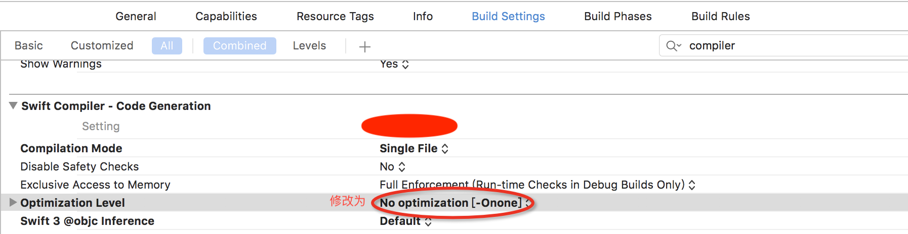

# OC与swift混编方法
## 背景
在Xcode9.3，swift3.3环境下调试

### 一、Swift访问OC	
Swift文件不需要import OC的类，统一在桥接文件`ProductName-Bridging-Header.h`中导入需要暴露给Swift的OC类即可

#### 步骤
1. 第一次在OC工程中创建一个.Swift文件，Xcode会提示你是否创建桥接文件，点击‘是’，Xcode会给每一个Target建立对应的桥接文件(Swift通过这个文件访问OC的类)。如果点击了‘否’，可以自己创建桥接文件，然后在下图位置指定桥接文件路径（多Target需要把每个Target都对应配置好）
 

2. 在桥接文件中`ProductName-Bridging-Header.h`导入Swift需要访问的OC类，.Swift文件就可访问OC的类了

### 二、OC访问Swift
在OC工程/文件导入`ProductName-Swift.h`文件（根据不同Target的名称，对应文件名称不同），即可访问Swift中暴露给OC的属性和方法。

#### 步骤

1. 工程Target中找到Build settings->Packaging->Defines Module设置为YES（多个Target的话，都需要设置）;
 
2. XCode会自动生成‘OC调用Swift接口头文件’,Build Settings->找到Objective-C Generated interface Header Name，如下图

## Tips
1. Swift4.0中想要暴露给OC的方法和属性前面都需添加@objc;
2. Swift单例一定要重写init方法，因为单例模式必须禁用构造方法：
		
		private override init() {
        print("[TestKit:init]")
        super.init()
    	}

## Swift环境遇到的问题
1. Swift环境下调试，断点无效：
Swift编译器配置问题，Build Settings修改Optimization Level为No Optimization。解决方案：

