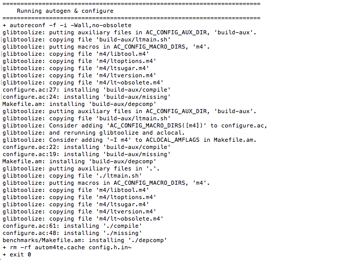
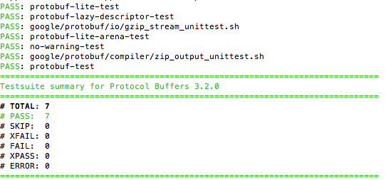
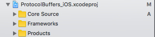
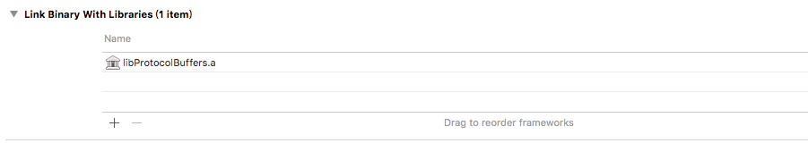
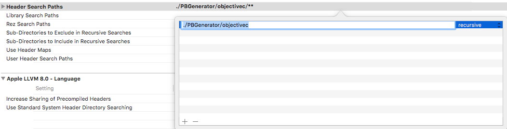

## 背景介绍
Protocol Buffer(以下简称PB)是Google推出的一种数据交换的格式，这种数据交换的概念与平台和语言无关。目前PB提供了多种语言的实现：java、Objective-C、c#、c++、go 和 python，每一种实现都包含了相应语言的编译器以及库文件。由于它是一种二进制的格式，比使用XML进行数据交换快许多。可以把它用于分布式应用之间的数据通信或者异构环境下的数据交换。作为一种效率和兼容性都很优秀的二进制数据传输格式，可以用于诸如网络传输、配置文件、数据存储等诸多领域。
## 安装步骤
1. 从git上下载PB的源码，这里是[链接地址](https://github.com/google/protobuf)，我们只需要关注objectivec文件夹便可以了。
2. 为了PB能在mac上编译，可能还需要安装protobuf autoconf,libtool,automake这四个依赖库，选择使用brew安装就行，打开终端输入以下四个命令：
	
		brew install autoconf
		brew install libtool
		brew install automake
		brew install protobuf

    其中automake的安装可能会连接到被墙的网站，从网上找一份谷歌host即可；
3. 解压下载的 protobuf-master，并进入到/protobuf-master/objectivec/DevTools/ 目录下执行 sudo sh full_mac_build.sh。这里可能会有些小问题，应该是步骤2的问题，有可能是三个包的安装有问题，也有可能是需要更新brew。

	可能遇到的问题: Warning: libtool-2.4.6 already installed, it's just not linked
	
	解决方案：brew uninstall protobuf 然后 brew update 最后重新执行一遍步骤2。

4. 运行objectivec/DevTools/ 目录下的`full_mac_build.sh`，这里需要等一段时间。看到下图就是在运行了：

5. 运行完毕后成功会看到这个图：

也可以在终端输入 protoc --version 来验证，安装成功会有版本号显示。

## Code Test
好不容易安装好了，测试一下PB吧。

1. 新建一个文件夹test，添加一个PBTest.proto文件（一般后缀是.proto），然后在其中写入：

		syntax = "proto3";
		message PBTest {
			string query = 1;
			int32 page_number = 2;
			int32 result_per_page = 3;
			enum Corpus {
			UNIVERSAL = 0;
			WEB = 1;
			IMAGES = 2;
			}
			Corpus corpus = 4;
		}

	这里默认PBTest.proto文件和生成的pb.h和pb.m一个文件夹，打开终端进入到test文件夹中，输入 `protoc --proto_path=. --objc_out=. PBTest.proto`即可。

2. 如何使用产生的pb文件

一般是把objectivec文件夹下与ProtocolBuffers_iOS.xcodeproj工程相关文件直接拖至自己的工程中即可。

编译一次ProtocolBuffers_iOS.xcodeproj，生成libProtocolBuffers.a文件，然后在测试工程中添加引入的SDK

最后在测试的工程中Header Search path添加`./测试工程名字/objectivec`就可以使用自定义的pb文件了。

## 结语
测试代码都在[PBGenerator工程里面](./)。

