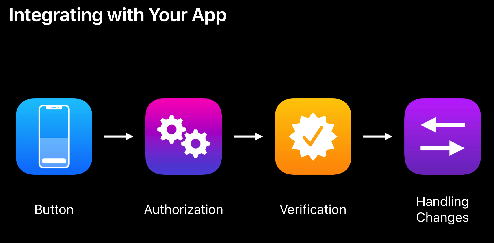
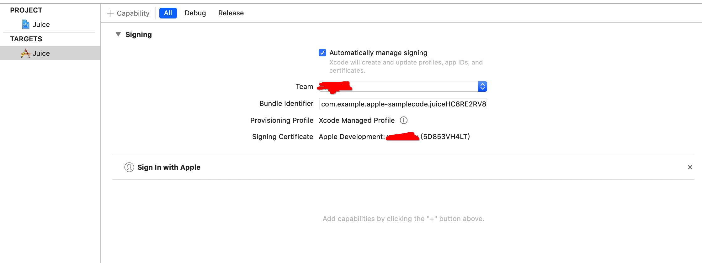
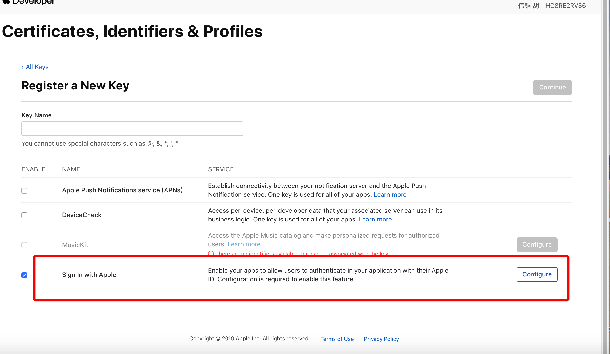
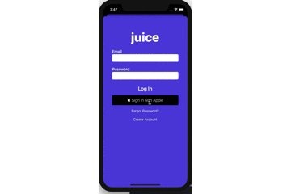

# Sign in with Apple体验

## 功能背景
WWDC 2019 Apple 公布了“Sign In with Apple”框架，可通过 Face ID/Touch ID/密码 验证来创建账户并保证不泄露用户隐私信息。每次通过“Sign In with Apple”登录时，可以选择实际邮箱或者创建一个随机邮箱（随机邮箱的邮件会转发至用户实际邮箱）；且用户可以随时删除已创建的随机邮箱。新版苹果审核条例明确要求符合条件的APP接入"Sign In with Apple"：[Updates to the App Store Review Guidelines](https://developer.apple.com/news/?id=06032019j)。
## 能力特性
[官网介绍](https://developer.apple.com/sign-in-with-apple/)

1. Better user experience：Streamlined account setup和Verified email addresses强调提供更好的用户体验；
2. Higher level security：Built-in security和Anti-fraud强调系统提供账号安全验证机制；
3. Multiply-platform：通过统一ID提供便捷的关联多平台数据的能力（包括网页）；

## 能力实现
多数资料猜测Sign in With Apple是基于OAuth2.0。[nativescript](https://www.nativescript.org/blog/ios-13-sign-in-with-apple-ipados-and-arkit-3-all-on-nativescript)，[[App Makers Are Mixed on ‘Sign In With Apple’](https://www.wired.com/story/sign-in-with-apple-mixed-reactions/)。

## 现有影响
### 对用户

1. 提高对用户隐私的保障：可以使用虚拟email地址；
2. 更快捷的登录方式：点击授权即可；
3. 多平台简化登录行为：苹果现有平台+网页；

### 对开发者

1. 增加接入和维护成本：framework接入，需要授权，与现有账号体系不相同，需要添加兼容逻辑
2. 获取的用户数据变少：只有ID/姓名/email
3. 减少虚假账号：开通Apple登录需要FaceID/TouchID验证
4. Apple登录UI需要遵循Apple的设计原则：[链接](https://developer.apple.com/design/human-interface-guidelines/sign-in-with-apple/overview/)

## 接入步骤

1. 工程需要添加能力：Sign in with Apple

2. 目前测试显示：一个Apple账号会对应一个ID，也就是说：删掉App/切换机器/系统重置，返回的ID都不会变化。

## 一些思考
1. 苹果的目的：security（video多次提到），user experience，cross-platform。cross-platform的账号体系是国内已有的玩法，估计这些功能点在其他国家地区会比较吸引人。security也会是一个增强平台吸引力的点，国外对隐私都较为敏感，如：欧盟的GDPR（通用数据保护条例）；
2. 比现有第三方登录方案简单：APP内部即可实现登录授权，不用跳转，也不用输入验证码，确实用户体感好很多；
3. 对国内已有成熟账号体的APP系贡献不大：返回用户信息数据过于简单，对于有风控需求的APP，Apple这套授权登录体系对开发者（服务提供商）显得过于单薄。

## 参考Demo

Demo地址：[链接](https://github.com/huweitao/AppleSampleJuice)

## 最后总结
接入成本不高，对国内已有成熟账号体系的APP而言，只是增加一个第三方登录授权的渠道，但提供增益较低。但对于Apple生态而言，基于系统级别的一账通，打通了Apple体系内多个平台，将不同平台的用户的数据可关联起来可以衍生出很多服务与产品，值得期待Apple下一步的动作

## 参考资料
1. [苹果表示iOS 13使用Apple登录按钮比输入密码更加安全](http://www.sohu.com/a/320191816_586435?scm=1002.0.0.0-0)
2. [Sign In with Apple - 使用苹果账号登录你的应用](https://xiaozhuanlan.com/topic/8675913204)
3. [App Makers Are Mixed on ‘Sign In With Apple’](https://www.wired.com/story/sign-in-with-apple-mixed-reactions/)

## 下载链接
1. WWDC 2019提供的新版macOS, XCode, iOS [下载链接](https://developer.apple.com/download/#ios-restore-images-iphone-new)
2. Sign In with Apple offical demo project [download](https://developer.apple.com/documentation/authenticationservices/adding_the_sign_in_with_apple_flow_to_your_app)
