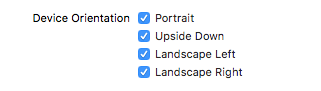
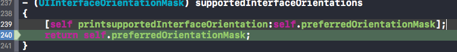
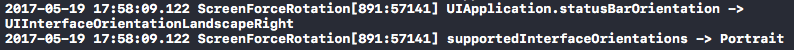

#iOS应用强制切换横竖屏
##背景及需求
原项目产品设计之初只支持横屏，但是随着产品需求的升级，产品需要添加竖屏支持来满足更多操作环境下的用户需求。

##方案调研及存在问题
1. 基于手机的系统通知，当`UIInterfaceOrientation`变化时，通过监听相关通知来修改布局。这种通过监听方向变化的方式来改变布局的解决方案与需求不符。
2. 利用`transform`+修改`bounds`来改变`UIViewController`的`view`来模拟横竖屏效果，淡淡这样做并不能改变keyboard出现的方向。
3. 修改'[UIDevice currentDevice].orientation'的值来切换方向，亲测`iOS8`以上没有效果，而且`orientation`值的修改一般需要使用私有接口，审核上也会存在风险。
4. 展示一个新的`UIViewController`，并且重写以下三个方法：
	
		- (BOOL)shouldAutorotate
		- (UIInterfaceOrientationMask) supportedInterfaceOrientations
		- (UIInterfaceOrientation) preferredInterfaceOrientationForPresentation

但是需求是要求立即切换方向，展示一个新的`UIViewController`明显维护起来很费事。

##需求目标
1. 切换方向后整体布局的坐标正确：bounds和frame与方向变化一致。
2. 切换方向后系统状态栏位置正确：Status Bar与方向变化一致
3. 切换方向后键盘弹出的位置正确：keyboard出现的方向与方向变化一致

##方案实现的关键点

1. 考虑到有Base NavigationController，所以transform变化需要从NavigationController下手。
2. Status Bar的方向可以通过以下接口设定：

		[[UIApplication sharedApplication] setStatusBarOrientation:orientation];
		
3. 需要在工程`General`里设定好应用需要支持的方向（demo实现了所有方向），因为`iOS9`以上这个配置项直接影响Keyboard支持的方向。

	
	
4. 为了支持实时变化的方向，supportedInterfaceOrientations和preferredInterfaceOrientationForPresentation需要使用属性来记录实时变化的方向参数，然后返回给调用者（因为每次键盘弹出来的时候会调用`- (UIInterfaceOrientationMask) supportedInterfaceOrientations`）。所以还需要重写以下3个方法：

		- (BOOL)shouldAutorotate
		{
   			 return NO;
		}

		- (UIInterfaceOrientationMask) supportedInterfaceOrientations
		{
		    return self.preferredOrientationMask;
		}
		
		- (UIInterfaceOrientation) preferredInterfaceOrientationForPresentation
		{
		    return self.preferredSupportedOrientation;
		}

5. Demo默认启动是portrait，但是plus机型开启自动旋转后，`view`正常的`transform`逻辑就不对了。这是由于横屏启动App的时候Status Bar与`ViewCotroller`支持的方式不匹配导致的，如下图所示：

这种情况需要在`ViewDidLoad`的时候检测一次，作为调整`transform`逻辑的参考即可。

##总结
强制横竖屏能满足以下四个目标即可：

1. Status bar位置正确
2. Navigation bar位置正确
3. 所有view及其subview的布局位置正确
4. 响应事正常（键盘，点击，远程控制等）

以上四点保证了屏幕方向变化对于用户在视觉和操作上没有任何影响。