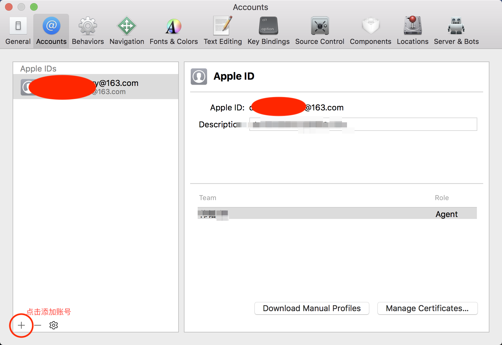

# XCode9免证书调试
## 配置流程
1. 进入xcode，菜单栏选择XCode –> preferences，在Accounts选项卡添加自己的Apple ID

2. 添加成功后，选择右下角的Manage Certificates

3. 弹出对话框里面点击左下角的+号，然后选择IOS Development，然后点击done完成。

4. 修改bundleID，因为GCashDemo的bundleID是具体的ID（specific bundleID），免费开发者证书生成的profile是通配方式（wild bundleID），需要把'com.alipay.plus.mynt.demo'改为'com.alipay.plus.mynt.*'即可

5. 进入工程，勾选Automatically manage signing，team选择刚才注册的账号。这里注意，免费开发者证书只有7天，过期后需要重新申请。

6. 实际调试的时候，需要在手机上先信任这个证书，然后就可以运行了

