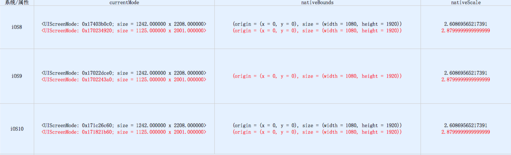

# 判断plus机型是否开启放大模式
## 问题背景
在一些plus机型上，处于放大模式的状态下，app的部分界面布局会有问题。因此，需要一种可以检测手机开启了放大模式的方法。
## 一些统计数据
plus机型对应的一些属性参数，在标准模式和放大模式是不一样的，且这些参数都是固定的，与系统无关(iOS8～iOS10上均有测试，
如果不太清楚下图中的三个属性，可以参考[`UIScreen`Apple文档的解释](https://developer.apple.com/reference/uikit/uiscreen?language=objc))，有图有真相：




## 总结
1. 如果想利用bounds区别plus机型，可以考虑使用nativeBounds（bounds是会变化的，不能使用bounds来区分机型）；
2. currentMode和nativeScale都是可以作为辨别手机是否开启了放大模式的参照标准；
3. 判断的代码如下：

```
// 判断PLUS机型
#define PLUS_H (IOS8_OR_HIGHER ? [UIScreen mainScreen].nativeBounds:[UIScreen mainScreen].bounds).size.height
#define PLUS_W (IOS8_OR_HIGHER ? [UIScreen mainScreen].nativeBounds:[UIScreen mainScreen].bounds).size.width
#define MAX_LENGTH (MAX(PLUS_H, PLUS_W)) // 绝对高度，解决横竖屏切换导致PLUS_H获取不准的问题
#define IS_IPHONE (UI_USER_INTERFACE_IDIOM() == UIUserInterfaceIdiomPhone)
#define IS_IPHONE_PLUS (IS_IPHONE && MAX_LENGTH >= 1920.0)

// 判断放大模式
#define IS_SCALE_MODE (IOS8_OR_HIGHER && [UIScreen mainScreen].nativeScale > 2.8)
```

