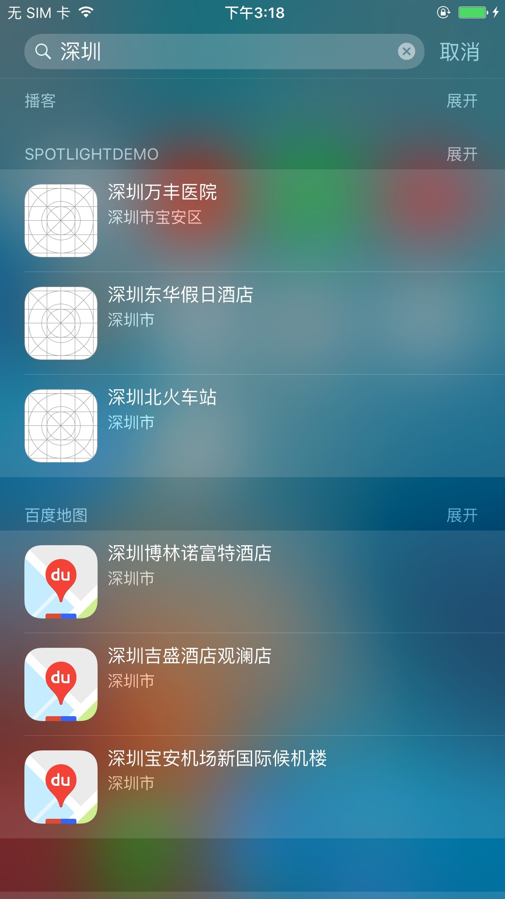
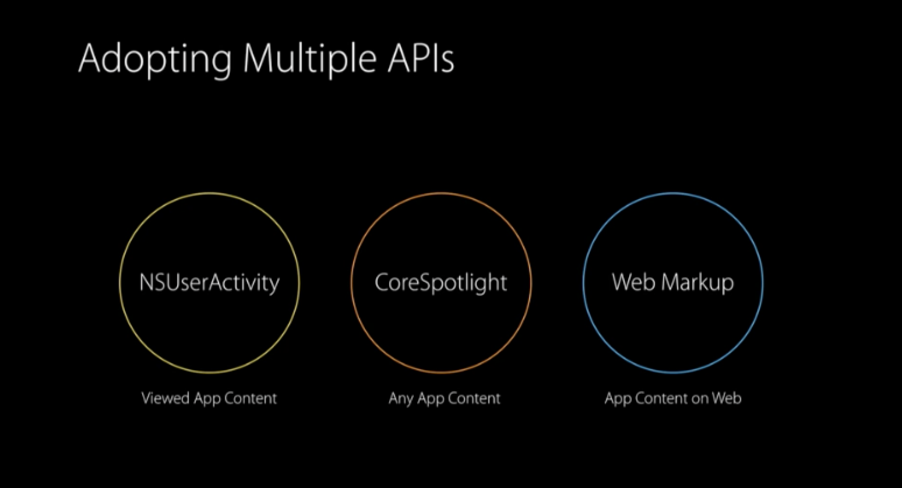

# 背景
在`Spotlight`中输入关键字发起搜索的时候，与这个关键字相关的app会优先展示。这里拿地图app来举个例子：在`Spotlight`里发起搜索某个热门地理位置，地图类app总是被优先推荐。所以，善用`Spotlight`的特性不仅极大的方便了用户操作，也有助于增加app的活跃度和用户曝光度。效果如下图所示：

## Spotlight简介
iOS自带的`Spotlight`是一个系统级的搜索功能，在系统中搜索关键词便会展现相关的内容，其中包括app内容、联系人、信息、邮件、歌曲等等。

在`iOS8`版本的时候，`iPhone`已经开始系统内置支持`Spotlight`搜索了，但是`Spotlight`这个功能并没有对开发者提供可用的API。而在`Apple`发布`iOS9`的时候，特意强化了这种搜索方式（与之配合的还有两种搜索方式：[NSUserActivity](https://developer.apple.com/library/prerelease/content/documentation/General/Conceptual/AppSearch/Activities.html#//apple_ref/doc/uid/TP40016308-CH6-SW1)和[Web Markup](https://developer.apple.com/library/prerelease/content/documentation/General/Conceptual/AppSearch/WebContent.html#//apple_ref/doc/uid/TP40016308-CH8)，三者可以配合使用来强化系统对App内容索引的支持）。

这里简单描述下苹果所强调的系统级应用内搜索[(In-App Search)](https://developer.apple.com/library/prerelease/content/releasenotes/General/WhatsNewIniOS/Articles/iOS9.html#//apple_ref/doc/uid/TP40016198-SW1)：不用打开App，直接在`Spotlight`的输入框中输入所需的内容，应用的任意内容都可以被`Spotlight`索引到。这种能力使iPhone即使在系统界面也能引导用户去点击与搜索内容相关的app，触发app对应的行为。

## 使用Spotlight
早在WWDC2015就详细介绍过[`Spotlight`这种搜索方式](https://developer.apple.com/videos/play/wwdc2015/709/)，`Spotlight`几乎能支持App内所有内容的索引：文字、电话、地理位置、URL链接和图片等。测试发现能够被`Spotlight`索引的内容数目（关键字）能达到几万条/App。加入这项功能其实很简单：首先需要在App工程里引入`<CoreSpotlight/CoreSpotlight.h>`，然后在代码中配置需要加入索引的节点（item）即可：

	CSSearchableItemAttributeSet *attributeSet = [[CSSearchableItemAttributeSet alloc] initWithItemContentType:[AttributeSetType copy]];
    attributeSet.title = @"SpotlightDemo_Camera";
    attributeSet.version = [UIDevice currentDevice].systemVersion;
    attributeSet.keywords = @[@"camera",@"spotlight",@"demo"];
    attributeSet.contentDescription  = @"这是spotlight demo camera";
    attributeSet.thumbnailData = UIImageJPEGRepresentation([UIImage imageNamed:@"camera.jpg"],1.0);
    CSSearchableItem *item = [[CSSearchableItem alloc] initWithUniqueIdentifier:[NSString stringWithFormat:@"%@.camera",ImagePrefixID] domainIdentifier:[ImageDomainID copy] attributeSet:attributeSet];
    
    CSSearchableItemAttributeSet *attributeSet2 = [[CSSearchableItemAttributeSet alloc] initWithItemContentType:[AttributeSetType copy]];
    attributeSet2.title = @"SpotlightDemo_Blow";
    attributeSet2.version = [UIDevice currentDevice].systemVersion;
    attributeSet2.keywords = @[@"blow",@"spotlight",@"demo"];
    attributeSet2.contentDescription  = @"这是spotlight demo blow";
    attributeSet2.thumbnailData = UIImageJPEGRepresentation([UIImage imageNamed:@"blow.jpg"],1.0);
    CSSearchableItem *item2 = [[CSSearchableItem alloc] initWithUniqueIdentifier:[NSString stringWithFormat:@"%@.blow",ImagePrefixID] domainIdentifier:[ImageDomainID copy] attributeSet:attributeSet2];

然后调用`Spotlight`加入索引节点
    
    [[CSSearchableIndex defaultSearchableIndex] indexSearchableItems:@[item,item2] completionHandler:^(NSError * _Nullable error) {
        NSLog(@"Fail to insert item %@",error);
    }];
    
当在系统界面`Spotlight`发起搜索后，点击进入，会触发`AppDelegate`：

	- (BOOL)application:(UIApplication *)application didFinishLaunchingWithOptions:(NSDictionary *)launchOptions {
    if (launchOptions[CSSearchableItemActionType]) {
        NSString *itemID = launchOptions[CSSearchableItemActivityIdentifier];
        NSLog(@"Spotlight id %@",itemID);
    }
    return YES;
	}
	- (BOOL)application:(UIApplication *)application continueUserActivity:(NSUserActivity *)userActivity restorationHandler:(void (^)(NSArray * _Nullable))restorationHandler
	{
    
    if ([userActivity.activityType isEqualToString:CSSearchableItemActionType]) {
        NSString *itemID = userActivity.userInfo[CSSearchableItemActivityIdentifier];
        NSLog(@"Spotlight id %@",itemID);
    }
    else {
        return NO;
    }
    return YES;
	}

以上两个`delegate`就是处理`Spotlight`参数的入口。

## Spotlight的实时搜索猜想
对于`<CoreSpotlight/CoreSpotlight.h>`框架而言，Apple是没有提供实时搜索接口的，但是地图类app却做到了类似实时的搜索。Why？通过仔细留意搜索步骤可窥见其实现方式。这是一个利用`Spotlight`本地索引方式伪装成‘实时搜索’的trick，原因如下：

1. 刚安装地图类app的时候，`Spotlight`是无法索引任何地图类app内容的。这就说明这种搜索需要至少打开一次app；

2. 刚安装地图类app后，关闭所有网络，`Spotlight`仍然无法索引任何地图类app内容的。这就说明这种搜索需要在有网络的情况下；

以上两点可以猜到这种伪装的‘实时搜索’的实现方式了：通过网络下发关键字，然后本地通过`Spotlight`建立索引的模式来不停地更新索引库。这样随着时间的增加，自然能涵盖日常搜索的关键字了。

那么`Spotlight`建立索引库是否有大小限制？测试每次开机加载2W条关键词作为索引（太多了会影响性能），一共加载了10W条没有压力。也就是说`Spotlight`建立索引库上限可能不止这个数。实现‘实时搜索’功能而建立10W本地索引的方式确实有点暴力，至于数据产生的流量倒不用太担心，10W纯文字压缩后就200KB。

## 可行性分析
对于这种比较‘野蛮’的建立本地内容索引的方式，最需要考虑的就是内存和CPU的使用了。测试发现2W条关键字需要使用自动释放池＋GCD异步来降低内存和CPU的使用，以防止被系统的watch dog把app进程杀掉。实际上如果把地图10W条数据拷贝后放在本地资源中，压缩一下也就200KB，对于想通过`Spotlight`提高app使用率来说还是划算的。后续可以考虑加入server端支持，实时更新索引，根据地区和偏好每次下发一小部分关键字到app上，这样便可完善和增强`Spotlight`‘实时搜索’的功能。

## 较好的实现方案
1. 在app中预先将最火的2W条（这个数字看实际需求）关键字信息加入本地压缩资源包（最好是加密），app第一次启动就加载；

2. server端会不定时更新资源包，app利用网络增量更新来平衡数据量和实时性。

3. 对于app搜索过的关键词做`spotlight`索引，并上传server端，形成正反馈。