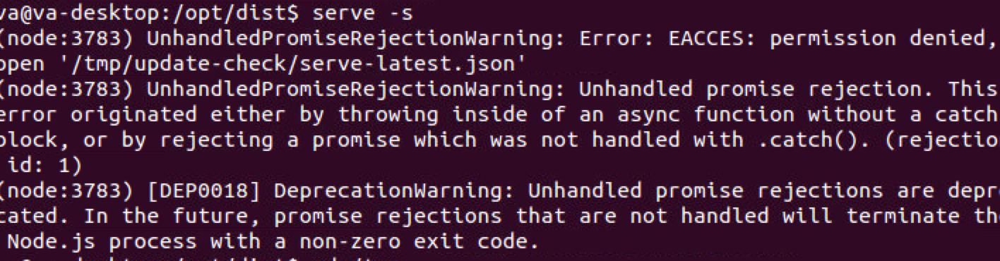

##ubuntu下的文件运行问题
###全局安装
ubuntu对文件权限的要求会比较严格（诡异），一般默认va用户而非root用户，可以通过命令:
	
	sudo i
切换到root用用户。

 
 
 ###可能遇到的一些问题
 
	serve 运行时：permisssion denied
		
如图：

 
 *解决方案*:查看是哪个文件或者文件夹权限不够，然后输入命令：
 
 	sudo chmod 777 file
 